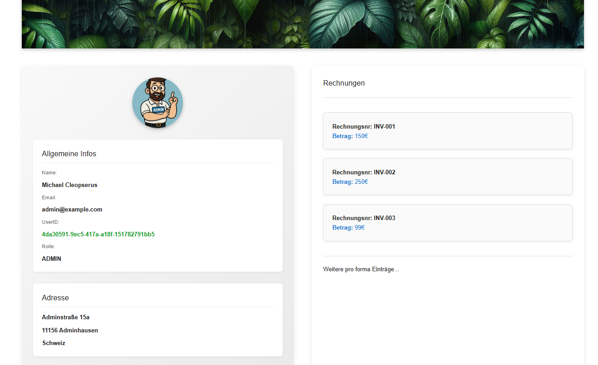
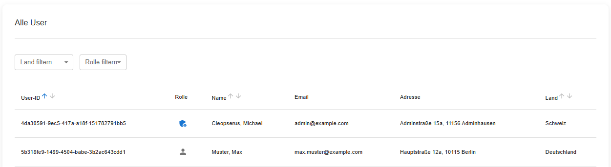

# Online-Shop

Ein Beispiel-Online-Shop mit **Next.js** im Frontend und **NestJS** im Backend, entwickelt als Demonstration für Bewerbungen und Projekte.

## Anstehende Features

- Admin-Funktion: **Nutzer löschen**  
- Navigation über eine **Navbar**  
- Grundlegende Warenfunktionen:
  - **Produktanzeige:** Übersicht aller verfügbaren Produkte  
  - **Produktdetails:** Detailansicht einzelner Produkte  
  - **Warenkorb-Funktion:** Produkte in den Warenkorb legen  
  - **Filter & Suche:** Produkte nach Kategorien, Name oder Preis filtern  
  - **Bestellung drucken:** Möglichkeit, den aktuellen Warenkorb als Bestellung zu drucken 

## Installation

1. Repository klonen:
```bash
  git clone https://github.com/till-priv-acc/Online-shop-CoBe.git
```

2. Frontend benutzen

```bash
  cd frontend
  npm install
  npm run dev
```

3. Backend benutzen
```bash
  cd backend
  npm install
  npm run start:dev
```

## Technologie-Stack

- **Frontend**: Next.js, Material UI

- **Backend**: NestJS, SQLite (oder andere DB)

- **Authentifizierung**: Session-basiert (bereits implementiert)

## Nutzung

Frontend unter http://localhost:3000

Backend unter http://localhost:3001

## Projektstruktur

```text
  /frontend
    /pages
      /login
      /products
    
      /admin
  /backend
    /src
      /users
      /products
      /admin
```

## Aktuelle Bilder



**User-Detailbereich**  
Aktuell werden hier Pro-Forma-Invoices dargestellt.



**Admin-Bereich – User-Tabelle**  
Zentrale Übersicht aller registrierten Nutzer.  
Es stehen aktuell **2 Filtermöglichkeiten** sowie **3 Sortieroptionen** zur Verfügung.